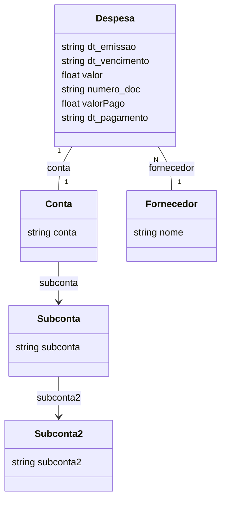

# DIO BootCamp Santander

## Diagrama de Classes (Domínio da API)

```mermaid
classDiagram
  class Despesa {
    string dt_emissao
    string dt_vencimento
    float valor
    string numero_doc
    float valorPago
    string dt_pagamento
  }

  class Conta {
    string conta
  }

  class Subconta {
    string subconta
  }

  class Subconta2 {
    string subconta2
  }

  class Fornecedor {
    string nome
  }

  Despesa "1" -- "1" Conta : conta
  Conta --> Subconta : subconta
  Subconta --> Subconta2 : subconta2
  Despesa "N" -- "1" Fornecedor : fornecedor
```
